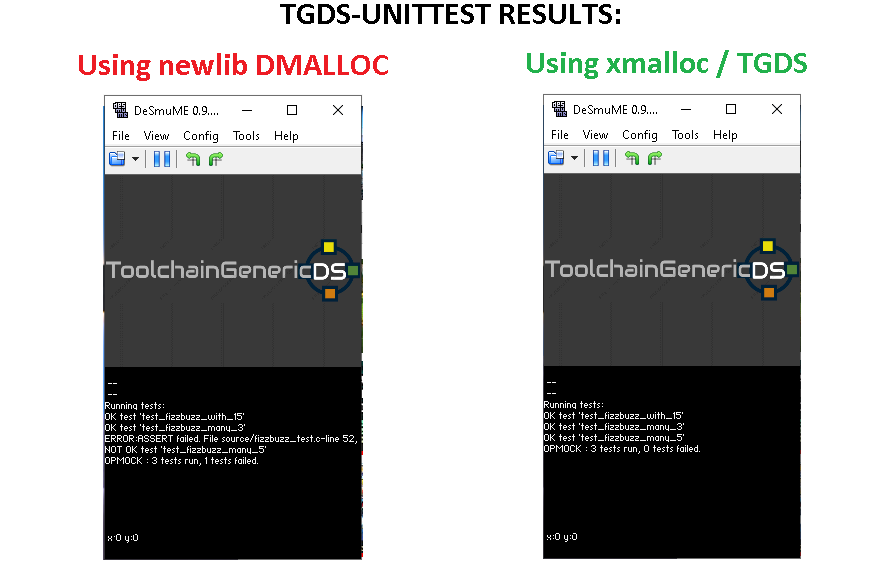

This is the ToolchainGenericDS-UnitTest project:

1.	Compile Toolchain:
To compile this project you will need to follow the steps at https://bitbucket.org/Coto88/toolchaingenericds :
Then simply extract the project somewhere.

2.	Compile this project: 
Open msys, through msys commands head to the directory your extracted this project.
Then write:
make clean <enter>
make <enter>

After compiling, run the example in NDS. 

Project Specific description:
	Press Y button to perform a suite of tests to test Clang, and C/C++ functinality. Performs C/C++ tests, and should pass all of them.
	
Coto

Test Unit results in TGDS:

Malloc:

